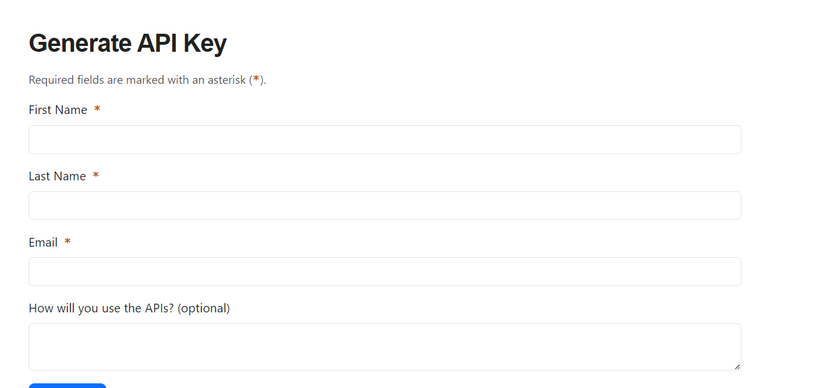
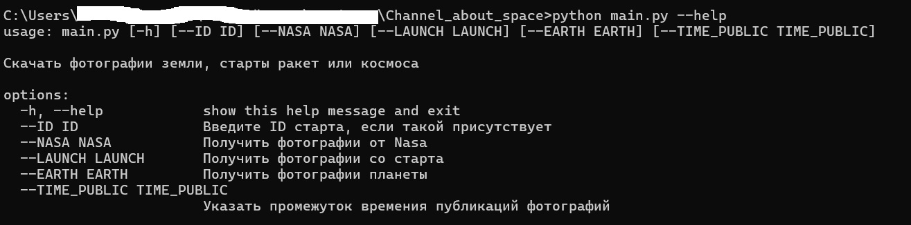
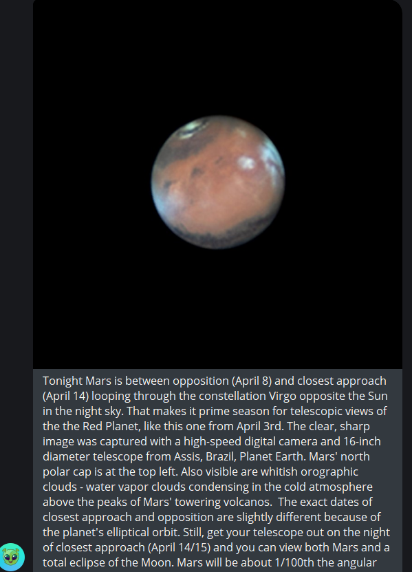

# Скрипт для публикации фотографий космической тематики в телеграмм канал
- Позволят скачивать фотографии и публиковать посты по космической тематики

## Как установить


  - ***Операционная система:***  
    - Windows 10 или новее
    - macOS 10.14 или новее
    - Linux (разные дистрибутивы)

  - ***Язык программирования:***  
    - Python 3.6 или новее


  ## Установка окружения

  1. Склонируйте репозиторий:
   [link](https://github.com/ArtyomRom/Channel_about_space.git)

  2. Создайте виртуальное окружение:
        ```bash
        python -m venv venv
        ```

  3. Активируйте виртуальное окружение:
   
    - На Windows:
      ```bash
      venv\Scripts\activate
      ```
    - На macOS/Linux:
        ```bash
        source venv/bin/activate
        ```

  4. Установите зависимости:
    ```bash
       pip install -r requirements.txt
    ```
  5. Получить токен для скачивания картинок можно на сайте https://api.nasa.gov
     
     Заполнив форму:
     
  
  6. Получить токен для телеграмм-бота с канала @BotFather
  7. Создать телеграмм группу и поставить телеграмм-бота администратором 
  8. В файле tg_bot.py в переменную `link_tg_channel` поставить ссылку на свою группу
  9. Запуск:
     - Пример
       ```bash
          python main.py --LAUNCH=1
       ```
       
     В качестве параметров можно передать откуда вы хотите получить фотографии
       - LAUNCH - фотографии с запуска SpaceX.
       - NASA - фотографии с сайта Nasa
       - EARTH - фотографии земли
       - ID - если указать будут скачены фотографии конкретного старта, в противном случае с последннего старта
       - TIME_PUBLIC - по умолчанию стоит 4 часа (частота публикаций в телеграмм канал)

## Цель проекта
  - Код написан в образовательных целях на онлайн-курсе для веб-разработчиков dvmn.org.

## Примеры поста в телеграмм группе:
  

 